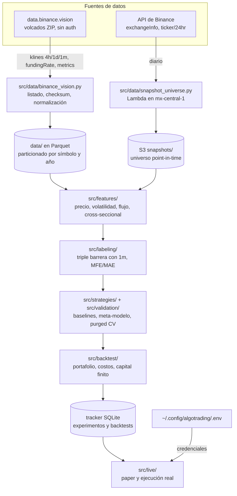

# Arquitectura

## Componentes del sistema actual

- **Ingesta histórica:** los volcados públicos de `data.binance.vision`, no la API. Son ZIP con
  checksum, sin autenticación y sin límite de rate; por la API serían cientos de miles de
  peticiones. Incluye los pares delistados, que es lo que permite un universo point-in-time.
- **Ingesta point-in-time:** una Lambda diaria captura `exchangeInfo` y `ticker/24hr`. La API
  solo responde por los símbolos vivos hoy, así que sin este snapshot el sesgo de supervivencia
  es irreparable hacia atrás.
- **Persistencia:** Parquet inmutable particionado, consultado con DuckDB. Nada de archivos que
  se reescriben completos.
- **Cómputo:** local durante investigación (Polars + DuckDB); la nube solo para lo que debe
  correr sin la laptop encendida.
- **Ejecución programada:** EventBridge Scheduler en UTC, que elimina la dependencia de la zona
  horaria local.

## Decisiones vigentes

**Parquet inmutable en vez de CSV reescritos.** El sistema anterior mantenía su estado en CSV
que se leían enteros y se sobrescribían. Eso impide escrituras concurrentes, consultas parciales
y cualquier auditoría de qué había el martes pasado. Las particiones de Parquet no se tocan una
vez escritas.

**El entorno se fija con `uv` y lockfile.** Python 3.12, dependencias declaradas en
`pyproject.toml` y `uv.lock` versionado. El Python del sistema no tiene `pip`, así que uv además
resuelve el problema de arranque sin sudo.

**Las credenciales viven fuera del repo y fuera de Google Drive**, en
`~/.config/algotrading/.env` con permisos 600. Dos llaves de Binance separadas, una de solo
lectura y otra con permiso de trade, ninguna con retiro y ambas con IP allowlist. Ver
[`operacion.md`](operacion.md).

**El stop loss vive en el exchange como orden OCO, no en el bot.** Es lo que permite prescindir
de un proceso encendido permanentemente: si la Lambda no corre, la protección sigue puesta.

**La capa agéntica es de solo lectura.** Reportes, triage y consulta del tracker; nunca decide
operaciones, nunca escribe en tablas de estado y nunca tiene credenciales del exchange. Un LLM
en el lazo de decisión no es determinista ni backtesteable con honestidad.

## Binance bloquea las IPs de Estados Unidos (2026-09-18)

La región de AWS es una decisión de arquitectura, no de latencia. Al desplegar la Lambda del
snapshot en `us-east-2` (Ohio), los cuatro endpoints devolvieron **HTTP 451 "Unavailable For
Legal Reasons"**. Comprobado con una Lambda sonda desechable
(`configs/probe-binance-region.sh`):

| Host | us-east-2 | mx-central-1 |
|---|---|---|
| `api.binance.com`, `api1`, `api-gcp` (spot) | 451 bloqueado | 200 OK |
| `fapi.binance.com` (futuros) | 451 bloqueado | 200 OK |
| `data-api.binance.vision` (spot público) | 200 OK | 200 OK |
| `data.binance.vision` (dumps históricos) | 200 OK | 200 OK |

Consecuencias:

- **La ingesta histórica no está en riesgo**: los dumps se descargan incluso desde EE.UU.
- **El spot en vivo tiene alternativa** (`data-api.binance.vision`, mismo `exchangeInfo`
  verificado campo a campo), **pero los futuros no**: ese host no sirve `/fapi`. Sin funding rate
  ni open interest no hay features de régimen.
- Por eso el cómputo vive en **`mx-central-1`**, fuera de la jurisdicción bloqueada y en la misma
  que el operador. El bucket permanece en `us-east-2`: la escritura entre regiones funciona y
  0.26 GB al año de transferencia cuesta centavos.
- Los roles de IAM son globales y se reutilizan; las políticas dejaron de fijar la región en sus
  ARNs y siguen acotadas por el prefijo `algotrading-*`.

**Regla para lo que viene: cualquier componente que hable con Binance debe vivir fuera de
EE.UU.**, incluida la ejecución de órdenes. Verificar con la sonda antes de desplegar en una
región nueva.

Estado tras la migración: la función `algotrading-snapshot` (python3.12, arm64, 512 MB, 120 s) y
el schedule `algotrading-snapshot-diario` con `cron(10 0 * * ? *)` en UTC. Una corrida real tarda
~7 s y usa 200 MB. `us-east-2` quedó desmantelado.

## Trampas encontradas, para no repetirlas

- **Una invocación exitosa no prueba nada si el trabajo se omitió.** Las dos primeras pruebas de
  la Lambda devolvieron 200 porque los objetos del día ya existían y el script es idempotente:
  nunca llamaron a Binance ni escribieron. El camino de escritura solo queda demostrado forzando
  la corrida (`{"force": true}`).
- **Lambda no falla cuando no puede escribir sus logs, simplemente se calla.** El rol de
  ejecución tenía `arn:aws:logs:us-east-2:...` grabado; en México escribía en S3 con normalidad
  mientras CloudWatch permanecía vacío. **El documento que está en AWS no es el que está en el
  repo** hasta que alguien lo aplica, y un componente mudo no es un componente sano.
- **Las unidades de tiempo de los volcados cambiaron a mitad del histórico**, de milisegundos a
  microsegundos en 2025, con el mismo formato y sin aviso. Asumir una sola unidad manda la mitad
  de las velas al año 57000 sin un solo error en pantalla. Se detecta por magnitud, valor por
  valor.
- **La cabecera de los CSV depende del mercado**: spot nunca la trae, futuros sí, y con esquemas
  distintos. El parser la olfatea en vez de asumirla.

---

## Historia: el sistema en R (congelado)

Hasta 2026-09-17 el proyecto era un conjunto de scripts en R que corrían a mano en RStudio, más
uno productivo por cron en una EC2. Vive en `src/legacy_r/` sin mantenimiento y **hoy no se
ejecuta**: no hay R instalado en el equipo.

Su arquitectura era: `binancer` pedía las velas a la API, `data.table` y `TTR` calculaban los
indicadores, el backtest recorría vela a vela y el estado se guardaba en CSV dentro de
`DataOut/`, que el script productivo leía y reescribía completos. Las credenciales salían de un
`config.yml` en la raíz y las rutas de local y EC2 se conmutaban comentando líneas.

**Por qué se congeló**, con números medidos y no por preferencia de lenguaje:

- El edge de la estrategia era del mismo orden que su costo: +0.384 % bruto por operación contra
  0.15 %–0.40 % de round trip, con 4.5 operaciones por par al mes.
- El modelo de ML tenía tres fugas apiladas que invalidaban sus métricas: split aleatorio sobre
  serie temporal, etiqueta parcialmente observable al decidir y features de nivel de precio.
- El universo entero eran pares `*BUSD`, que Binance descontinuó.
- El backtest ejecutaba al cierre de la vela que generaba la señal, llenaba los stops sin hueco y
  contabilizaba `cumYield` por par como si cada uno tuviera el 100 % del capital.

Lo único que se rescata es la lógica de órdenes válidas de
[`src/legacy_r/Tests/binance.R`](../src/legacy_r/Tests/binance.R) —`minNotional`, `stepSize`,
decimales—, que se porta a `src/services/exchange.py` en vez de redescubrirse.
