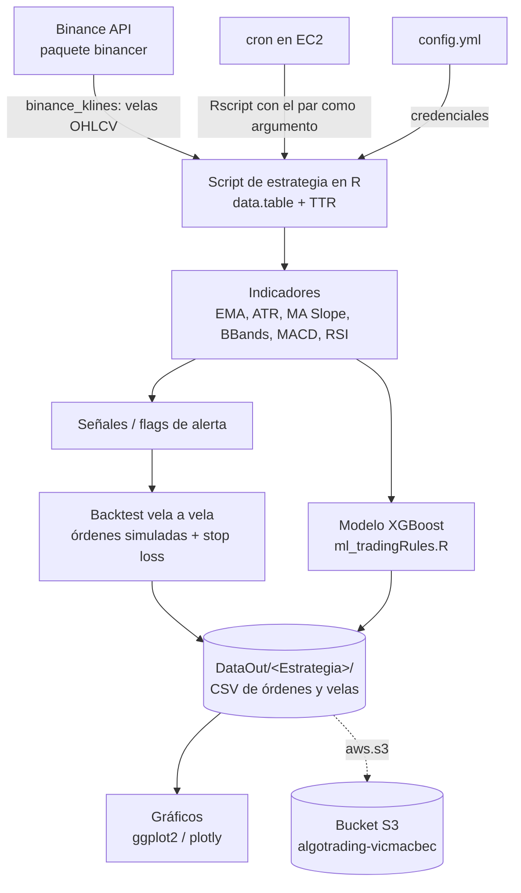

# Arquitectura

## Componentes

- **Ingesta:** no hay base de datos ni capa de persistencia propia. Cada corrida pide las velas
  a Binance con `binance_klines()` y, en el script productivo, las concatena a los CSV
  históricos que ya existen en `DataOut/`.
- **Cómputo:** todo en memoria con `data.table`; los indicadores vienen de `TTR` salvo el MA
  Slope, que se calcula a mano (ver [`reglas-negocio.md`](reglas-negocio.md)).
- **Persistencia:** archivos CSV en `DataOut/`, una carpeta por estrategia. El estado del
  backtest (`allOrders`, `allData`) vive en esos CSV: el script productivo los lee, los
  reescribe completos y no guarda nada más.
- **Ejecución programada:** un wrapper `.sh` llamado desde crontab en la EC2 invoca el `.R` con
  el símbolo como argumento y redirige la salida a un log por corrida.
- **Distribución:** `aws.s3` para subir y leer los CSV desde el bucket, de modo que la EC2 y la
  máquina local compartan los mismos datos.

## Decisiones tomadas

**CSV en vez de base de datos.** El volumen es de miles de velas por par y el consumo es
siempre "leer todo, recalcular, reescribir". Un CSV por estrategia mantiene el proyecto
portable entre la laptop y la EC2 sin infraestructura extra; el costo es que no hay escrituras
concurrentes ni consultas parciales.

**Dos versiones del mismo algoritmo.** `MASlope_ATRStopL.R` (investigación, todos los pares,
gráficos) y `MASlope_ATRStopL_Prod.R` (un par, sin gráficos, ~8 s). La versión productiva se
mantiene mínima para que quepa en una corrida de cron; la de investigación carga librerías
pesadas (plotly, patchwork) que en producción no hacen falta.

**Rutas absolutas conmutadas a mano.** Los scripts declaran las rutas de local
(`~/Drive/Codigos/AlgoTrading/`) y de la EC2 (`~/algoTrading/`), y se cambia de entorno
comentando líneas. Es la fuente de error más probable al desplegar; está registrado como
pendiente en [`pendientes.md`](pendientes.md).

**Órdenes reales desactivadas.** Las llamadas a `binance_new_order()` están comentadas en el
script productivo: hoy el sistema es paper trading y su única salida son los CSV. Las funciones
que sí construyen órdenes válidas (cantidades, `minNotional`, decimales) viven en
[`src/Tests/binance.R`](../src/Tests/binance.R) y son el punto de partida para operar en real.

**Migración de `Scripts/` a `src/` (2026-09-16).** Se adoptó la convención de la skill
`project-structure`. `git mv` conservó el historial; las rutas del wrapper `.sh`, del script
productivo, del `.gitignore` y del README se actualizaron en el mismo commit. El despliegue de
la EC2 y su crontab siguen apuntando a la ruta vieja y deben actualizarse por separado.
